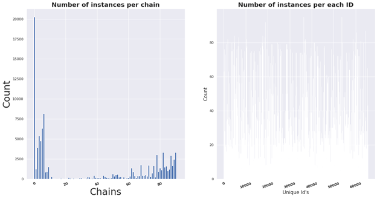

# Background:
Human Trafficking is the unlawful act of transporting or coercing people in order to benefit from their work or service, typically in the form of forced labor or sexual exploitation

The issue of human trafficking has received more widespread media attention and public concern in recent years as it is the world’s third-largest criminal industry, trailing only the drug and weapons trades.

It is estimated that there are 20-40 million victims of human trafficking globally, with hundreds of thousands in the United States. 

# Problem Statement:
This March, TraffickCam launched a [Kaggle contest](https://www.kaggle.com/c/hotel-id-2021-fgvc8/overview) that tasked competitors with identifying the hotel seen in test images from the TraffickCam dataset.

McGruff LLC aims to build a model that can pinpoint specific hotel IDs within the 7,770 hotels present in the dataset.

TraffickCam allows anyone with a smartphone to fight sex trafficking when they travel by uploading photos of hotel rooms to a law enforcement database. It is currently in use at the National Center for Missing and Exploited Children.

# EDA:

  

The two histograms characterize the sampling in the dataset. Figure A shows the number of images per hotel chain for each of the 88 major hotel chains
represented in the TraffickCam dataset. Figure B shows the number of images per hotel id. Some chains have many more images than others.

Average number of images per hotel ~20 samples

# Observations:
Within the TraffickCam dataset, a chain of zero (0) indicates that the hotel is either not part of a chain or the chain is not known.

There is the issue of high intra-class variation: not every room will have shared objects and some rooms may have been renovated.

Conversely, there is also the issue of low inter-class variation with hotels from the same chain.

# Modeling:

- Pre-trained VGG-16 network into PCA into Kmeans clustering
- CNNs of varying size, complexity, data augmentation, and regularization
- Out-of-the-box logistic regression

# Recommendations & Conclusion:

- Utilize top K accuracy as the evaluation metric setting K = {1,10,100}.
- Use clusters as additional feature for CNN
- Utilize pre-trained models

- Don’t try to fit on 97,000 images on CPU
- Don’t underestimate the size and complexity of the problem statement
- Don’t assume all Kaggle submission processes are the same

### Hotel recognition posed unique challenges. It required that our models learn both the shared ***and*** specific characteristics of hotel rooms. In the end, our best models only achieved ~2-4% validation accuracy. 

Moving forward, we plan on incorporating the cluster data into a CNN as an additional feature. 
Additionally, we would like to import a pre-trained model to do the heavy lifting, as fitting models on even small subsets of the dataset ended up taking hours.
